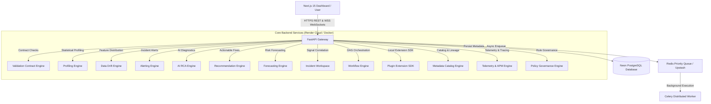

# Sentinel AI — Enterprise Data Quality, Observability & Root Cause Analysis Platform

[](https://fastapi.tiangolo.com)
[](https://nextjs.org)
[](https://python.org)
[](https://neon.tech)
[](https://upstash.com)
[](LICENSE)

**Sentinel AI** is an enterprise-grade, autonomous Data Quality, Observability, and Root Cause Analysis (RCA) platform built for industrial IoT streams, transactional databases, and complex multi-cloud data engineering pipelines.

Comparable to industry platforms like **Monte Carlo**, **Evidently AI**, **Datadog APM**, **Microsoft Purview**, **DataHub**, **Airflow**, **Prefect**, and **Grafana**.

---

## 🏛️ Platform Architecture

Sentinel AI is engineered following **Clean Architecture**, **Strategy Pattern**, **Specification Pattern**, **Factory Pattern**, **Observer Pattern**, and **State Machine Patterns** with zero switch statements and complete module decoupling.



---

## ✨ Key Enterprise Capabilities

1. **Multi-Source Connectors**: CSV, PostgreSQL, MySQL, Industrial Sensors, Kafka, AWS S3.
2. **Data Profiling Engine**: Null rates, uniqueness, cardinality, entropy, distribution histograms.
3. **Data Validation Contract Engine**: 21 built-in validation rules with automated scoring ($0-100\%$).
4. **Redis Priority Queue & Workers**: Production-ready background queue with Upstash Redis support.
5. **Real-Time WebSockets**: Live job progress streaming without page reloads.
6. **Data Drift Detection Engine**: PSI, Jensen-Shannon, KL Divergence, Wasserstein distance tracking.
7. **Enterprise Alerting Engine**: Quality score drops, validation failures, schema changes, PagerDuty/Slack routing.
8. **AI Root Cause Analysis (RCA)**: Deep anomaly diagnostic engine assigning root cause probability confidence scores.
9. **AI Remediation Engine**: Prioritized actionable recommendations with SQL fixes.
10. **Predictive Observability & Risk Forecasting**: Linear regression, exponential smoothing, failure probability forecasting.
11. **Unified Incident Workspace**: Correlates alerts, validation failures, drift events, and schema changes into timeline graphs.
12. **Workflow Orchestration Engine**: 9-step DAG pipeline coordinator (Airflow / Prefect style).
13. **Plugin Extension SDK**: 10 extension interfaces allowing third-party extensions (Grafana / Airbyte style).
14. **Enterprise Data Catalog & Lineage**: Metadata catalog, business glossary, retention policies, and cross-layer lineage DAG graphs.
15. **Platform Telemetry & APM Tracing**: Subsystem health probes, API throughput, worker utilization, and APM span waterfall timelines.
16. **Enterprise Policy Engine**: Specification Pattern governance rule engine (OPA / Azure Policy style).

---

## 🛠️ Technology Stack

- **Frontend**: Next.js 15 (App Router), TypeScript, TailwindCSS, Lucide Icons.
- **Backend**: Python 3.13, FastAPI, Pydantic V2, SQLAlchemy 2.0 (Async), Alembic, SlowAPI.
- **Queue & Async**: Celery, Redis / Upstash Redis.
- **Database**: PostgreSQL / Neon PostgreSQL.
- **Observability**: Custom APM Distributed Tracing, Telemetry Metric Collectors.
- **CI/CD & Containers**: Docker, Docker Compose, GitHub Actions, Render, Vercel.

---

## 📁 Repository Structure

```
.
├── backend/
│   ├── alembic/                 # Alembic Database Migrations (001 -> 014)
│   ├── app/
│   │   ├── ai/                  # AI Root Cause Analysis Engine
│   │   ├── alert_engine/        # Alerting & Incident Notification Engine
│   │   ├── api/v1/endpoints/    # REST & WebSocket API Routers
│   │   ├── catalog/             # Data Catalog & Lineage Engine
│   │   ├── connectors/          # Data Ingestion Connectors
│   │   ├── core/                # Config, Security, Limits & Logging
│   │   ├── db/                  # Database Session & Initialization
│   │   ├── drift_engine/        # Data Drift Detection Engine
│   │   ├── forecasting/         # Predictive Risk Forecasting Engine
│   │   ├── incidents/           # Unified Incident Investigation Workspace
│   │   ├── models/              # SQLAlchemy ORM Models & Enums
│   │   ├── plugins/             # Plugin & Extension SDK Engine
│   │   ├── policies/            # Policy Engine & Rule Governance
│   │   ├── recommendation_engine/# AI Remediation Recommendation Engine
│   │   ├── repositories/        # Clean Architecture Data Repositories
│   │   ├── services/            # Business Service Layer
│   │   ├── telemetry/           # Platform Telemetry & APM Tracing Engine
│   │   ├── validation_engine/   # 21 Data Quality Contract Rules
│   │   └── workflows/           # Workflow Orchestration Engine
│   ├── tests/                   # 125 Backend Pytest Unit & Integration Tests
│   └── Dockerfile               # Production Multi-Stage Backend Dockerfile
├── frontend/
│   ├── src/
│   │   ├── app/(dashboard)/     # Next.js 15 App Router Dashboard Pages
│   │   ├── components/          # Reactive Tailwind UI Components
│   │   └── types/               # TypeScript Type Definitions
│   ├── vercel.json              # Vercel Deployment Configuration
│   └── package.json             # Next.js Dependencies
├── docker-compose.yml           # Local Development Stack
├── docker-compose.prod.yml      # Production Docker Stack
├── render.yaml                  # Render Blueprint Service Declarations
└── .github/workflows/ci.yml     # GitHub Actions Continuous Integration Pipeline
```

---

## 🚀 Quick Start & Local Development

### 1. Prerequisites
- **Python 3.13+**
- **Node.js 20+**
- **Docker & Docker Compose**

### 2. Run Local Development Environment via Docker Compose

```bash
# Clone the repository
git clone https://github.com/sentinel-ai/sentinel-ai.git
cd sentinel-ai

# Spin up Postgres, Redis, Backend FastAPI, and Worker
docker-compose up --build
```

Access local endpoints:
- **Next.js Frontend**: `http://localhost:3000`
- **FastAPI Swagger API Docs**: `http://localhost:8000/docs`
- **FastAPI ReDoc Docs**: `http://localhost:8000/redoc`
- **Health Check Endpoint**: `http://localhost:8000/health`

### 3. Manual Local Development Setup

```bash
# Backend Setup
cd backend
python -m venv venv
source venv/bin/activate  # On Windows: venv\Scripts\activate
pip install -r requirements.txt
alembic upgrade head
uvicorn app.main:app --reload --port 8000

# Frontend Setup (in a separate terminal)
cd frontend
npm install
npm run dev
```

---

## ☁️ Production Cloud Deployment

### 1. Deploying Backend & Workers to Render.com
1. Connect your GitHub repository to **Render.com**.
2. Click **New** $\rightarrow$ **Blueprint**.
3. Select `render.yaml`.
4. Configure environment variables in Render Dashboard:
   - `DATABASE_URL`: Your **Neon PostgreSQL** URL (`postgresql+asyncpg://...`)
   - `REDIS_URL`: Your **Upstash Redis** URL (`rediss://...`)
   - `SECRET_KEY`: Minimum 32-character secret key.
   - `JWT_SECRET`: Minimum 32-character secret key.

### 2. Deploying Frontend to Vercel
1. Import repository into **Vercel**.
2. Set Root Directory to `frontend`.
3. Set Environment Variable:
   - `NEXT_PUBLIC_API_URL`: `https://sentinel-ai-backend.onrender.com/api/v1`
4. Click **Deploy**. Vercel will automatically build the Next.js 15 app using `frontend/vercel.json`.

---

## 🧪 Testing & Verification

Sentinel AI maintains strict test coverage and linting standards:

```bash
# Run backend pytest suite with coverage
cd backend
pytest tests/ --cov=app --cov-report=term-missing

# Run ruff linter
ruff check app/ tests/

# Validate Next.js 15 production build
cd ../frontend
npm run build
```

---

## 📄 License

Distributed under the MIT License. See `LICENSE` for details.
